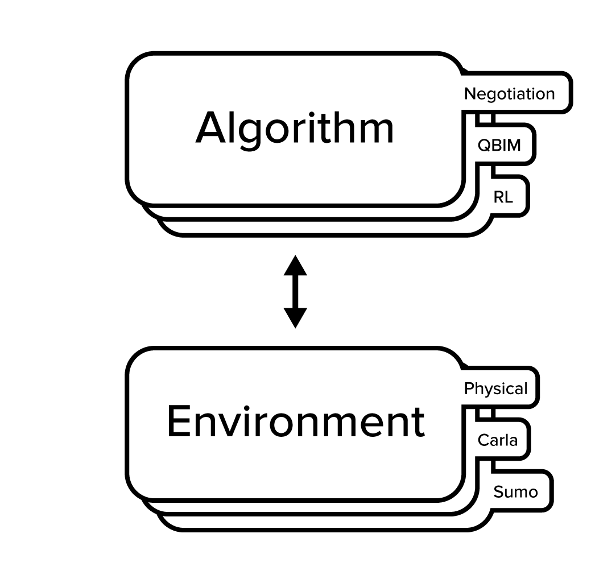
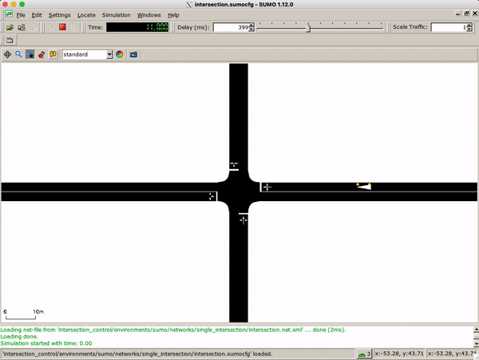

# IntersectionControl

> :warning: This repository is under **active development** for my BEng thesis and there is a high chance many APIs 
> and components will change in the near future

[](https://github.com/julesdehon/IntersectionControl/actions/workflows/python-app.yml)
[](https://intersectioncontrol.readthedocs.io/en/latest/?badge=latest)

An environment-agnostic framework for implementing and comparing intersection control algorithms



## Getting Started

### Installation

```shell
$ pip install intersection-control
```

Refer to the [documentation](https://intersectioncontrol.readthedocs.io/en/latest/usage/installation.html) for all
installation options

### Usage

For a more detailed description of various use-cases, please refer to the
[documentation](https://intersectioncontrol.readthedocs.io/en/latest/usage/quickstart.html).

To run a simple experiment using the QBIM algorithm and SumoEnvironment:

Import the desired algorithm/environment:

```python
from intersection_control.environments.sumo import SumoEnvironment, RandomDemandGenerator
from intersection_control.algorithms.qb_im import QBIMIntersectionManager, QBIMVehicle
```

Instantiate the environment:

```{note}
The RandomDemandGenerator here is used to programmatically add vehicles to specifically to the Sumo environment. 
Alternatively, Sumo based [demand generation](https://sumo.dlr.de/docs/Demand/Introduction_to_demand_modelling_in_SUMO.html)
could be used
```

```python
demand_generator = RandomDemandGenerator({
    "NE": 2, "NS": 2, "NW": 2, "EN": 2, "ES": 2, "EW": 2,
    "SN": 2, "SE": 2, "SW": 2, "WN": 2, "WE": 2, "WS": 2
}, 0.05)
env = SumoEnvironment("path/to/intersection.sumocfg",
                      demand_generator=demand_generator, time_step=0.05, gui=True)
```

Instantiate the vehicles and intersection managers:

```python
intersection_managers = {QBIMIntersectionManager(intersection_id, env, 10, 0.05) for intersection_id in
                         env.intersections.get_ids()}  # In this Sumo network there is only one intersection
vehicles = {QBIMVehicle(vehicle_id, env, communication_range=75) for vehicle_id in env.vehicles.get_ids()}
```

Run the main loop:

```python
STEP_COUNT = 360000  # 1 hour
for _ in range(STEP_COUNT):
    env.step()
    removed_vehicles = {v for v in vehicles if v.get_id() in env.get_removed_vehicles()}
    for v in removed_vehicles:
        v.destroy()
    new_vehicles = {QBIMVehicle(vehicle_id, env, communication_range=75)
                    for vehicle_id in env.get_added_vehicles()}
    vehicles = (vehicles - removed_vehicles).union(new_vehicles)
    for vehicle in vehicles:
        vehicle.step()
    for intersection_manager in intersection_managers:
        intersection_manager.step()
```

This simple example is available in `misc/main.py`:



### Exploring the code

For a full description of the code's structure please refer to
the [documentation](https://intersectioncontrol.readthedocs.io/en/latest/overview/overview.html)

The directory structure is as follows:

```
IntersectionControl
├── docs  # Documentation images and files
├── intersection_control  # The main source code package
│   ├── core  # Defines all interfaces and defines the component structure
│   │   ├── environment  # Provides an interface for any environment to implement
│   │   │   ├── environment.py  # Defines the base Environment class
│   │   │   ├── intersectiont_handler.py  # Defines the base IntersectionHandler class 
│   │   │   └── vehicle_handler.py  # Defines the base VehicleHandler class
│   │   ├── algorithm
│   │   │   ├── vehicle.py  # Defines the base Vehicle class
│   │   │   └── intersection_manager.py  # Defines the base IntersectionManager class
│   │   ├── communication.py  # Provides an interface for communication - V2V or V2I is possible. Specifically, defines the base MessagingUnit class
│   │   └── performance_indication.py  # Defines the base PerformanceIndicator class (Not yet implemented)
│   ├── algorithms  # A collection of intersection control algorithm implementations (for now only QBIM). These are implementations of core.Vehicle and core.IntersectionManager
│   ├── environments  # A collection of environment implementations (for now only SUMO). These are implementations of core.Environment
│   └── communication  # A collection of communication implementations (for now only DistanceBasedUnit). These are implementations of core.MessagingUnit
├── test  # unit tests for various components
└── misc  # Miscellaneous stand-alone scripts and experiments
```