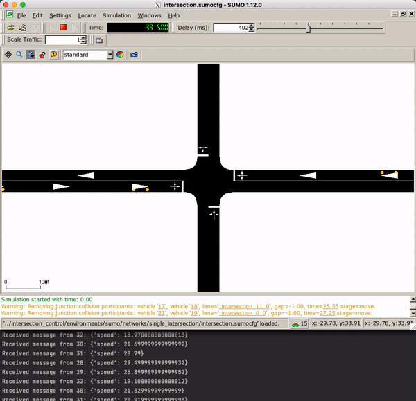

# Getting started

## Running an experiment/simulation
To run a simulation, you will need an implemented algorithm (which determines the behaviour of vehicles and 
intersection managers through the intersection) and an environment (the simulation environment in which the 
experiment runs). For a more detailed description of the structure of IntersectionControl, refer to the [Project 
Structure](../overview/overview.md) page.

Let's see how you would set up an experiment for a query-based intersection control algorithm in the Sumo simulation 
environment.

Note that you will need Sumo network (`.net.xml` and `.sumocfg`) files to run a Sumo simulation. A simple 
single-laned 4-way intersection network configuration can be found in 
`intersection_control/environments/sumo/networks/single_intersection`

Import the desired algorithm/environment:
```python
from intersection_control.environments.sumo import SumoEnvironment, RandomDemandGenerator
from intersection_control.algorithms.qb_im import QBIMIntersectionManager, QBIMVehicle
```

Instantiate the environment:
```{note}
The RandomDemandGenerator here is used to programmatically add vehicles to specifically to the Sumo environment. 
Alternatively, Sumo based [demand generation](https://sumo.dlr.de/docs/Demand/Introduction_to_demand_modelling_in_SUMO.html)
could be used
```
```python
demand_generator = RandomDemandGenerator({
    "NE": 2, "NS": 2, "NW": 2, "EN": 2, "ES": 2, "EW": 2,
    "SN": 2, "SE": 2, "SW": 2, "WN": 2, "WE": 2, "WS": 2
}, 0.05)
env = SumoEnvironment("path/to/intersection.sumocfg",
                      demand_generator=demand_generator, time_step=0.05, gui=True)
```

Instantiate the vehicles and intersection managers:
```python
intersection_managers = {QBIMIntersectionManager(intersection_id, env, 10, 0.05) for intersection_id in
                         env.intersections.get_ids()}  # In this Sumo network there is only one intersection
vehicles = {QBIMVehicle(vehicle_id, env, communication_range=75) for vehicle_id in env.vehicles.get_ids()}
```

Run the main loop:
```python
STEP_COUNT = 360000  # 1 hour
for _ in range(STEP_COUNT):
    env.step()
    removed_vehicles = {v for v in vehicles if v.get_id() in env.get_removed_vehicles()}
    for v in removed_vehicles:
        v.destroy()
    new_vehicles = {QBIMVehicle(vehicle_id, env, communication_range=75)
                    for vehicle_id in env.get_added_vehicles()}
    vehicles = (vehicles - removed_vehicles).union(new_vehicles)
    for vehicle in vehicles:
        vehicle.step()
    for intersection_manager in intersection_managers:
        intersection_manager.step()
```

When run, this should result in a simulation that looks something like this:


## Implementing an intersection control algorithm

This is done by creating a new subclass of `intersection_control.core.Vehicle` and `intersection_control.core.
IntersectionManager`. Note that if you would like to implement a decentralised control algorithm (one where there is 
no central intersection manager), you would only have to subclass `Vehicle`.

Let's create a very simple and stupid algorithm where at every step, vehicles communicate their speed to the 
nearby intersection manager, and then increases its speed by 1m/s:

```python
from intersection_control.core import Vehicle, IntersectionManager, Environment, Message
from intersection_control.communication import DistanceBasedUnit


class StupidVehicle(Vehicle):
    def __init__(self, vehicle_id: str, environment: Environment):
        super().__init__(vehicle_id, environment)
        self.messaging_unit = DistanceBasedUnit(vehicle_id, 50, self.get_position)

    def step(self):
        # This assumes every intersection manager id will start with "intersection"
        for im in [im for im in self.messaging_unit.discover() if im.startswith("intersection")]:
            self.messaging_unit.send(im, Message(self.vehicle_id, {"speed": self.get_speed()}))
        self.set_desired_speed(self.get_speed() + 1)

    # Required when using the DistanceBasedUnit
    def destroy(self):
        self.messaging_unit.destroy()


class StupidIntersectionManager(IntersectionManager):
    def __init__(self, intersection_id: str, environment: Environment):
        super().__init__(intersection_id, environment)
        self.messaging_unit = DistanceBasedUnit(intersection_id, 50, self.get_position)

    def step(self):
        for message in self.messaging_unit.receive():
            print(f"Received message from {message.sender}: {message.contents}")
```

As you can see, implementing an intersection control algorithm simply requires defining the `step()` function for 
each vehicle and intersection manager, which will determine its behaviour at each simulation step.

Unsurprisingly, this algorithm leads to lots of crashes:


## Implementing an intersection environment

Implementing your own intersection environment is much more involved that implementing a control algorithm. To do 
this, you will need to subclass `intersection_control.core.environment.Environment`, `intersection_control.core.
environment.VehicleHandler` and `intersection_control.core.environment.IntersectionHandler`. Each of those classes 
will have a number of abstract methods that will need to be implemented.

```python
from typing import List, Tuple
import time
from intersection_control.core.environment import Environment, IntersectionHandler, VehicleHandler


class UselessVehicleHandler(VehicleHandler):
    def get_speed(self, vehicle_id: str) -> float:
        return 0

    def get_position(self, vehicle_id) -> Tuple[float, float]:
        return 0, 0
    # ...


class UselessIntersectionHandler(IntersectionHandler):
    def get_width(self, intersection_id: str) -> float:
        return 0

    def get_height(self, intersection_id: str) -> float:
        return 0

    def get_position(self, intersection_id: str) -> Tuple[float, float]:
        return 0, 0
    # ...


class UselessEnvironment(Environment):
    def __init__(self):
        self._intersections = UselessIntersectionHandler()
        self._vehicles = UselessVehicleHandler()

    @property
    def intersections(self) -> IntersectionHandler:
        return self._intersections

    @property
    def vehicles(self) -> VehicleHandler:
        return self._vehicles

    def get_current_time(self) -> float:
        return time.time()
    # ...
```